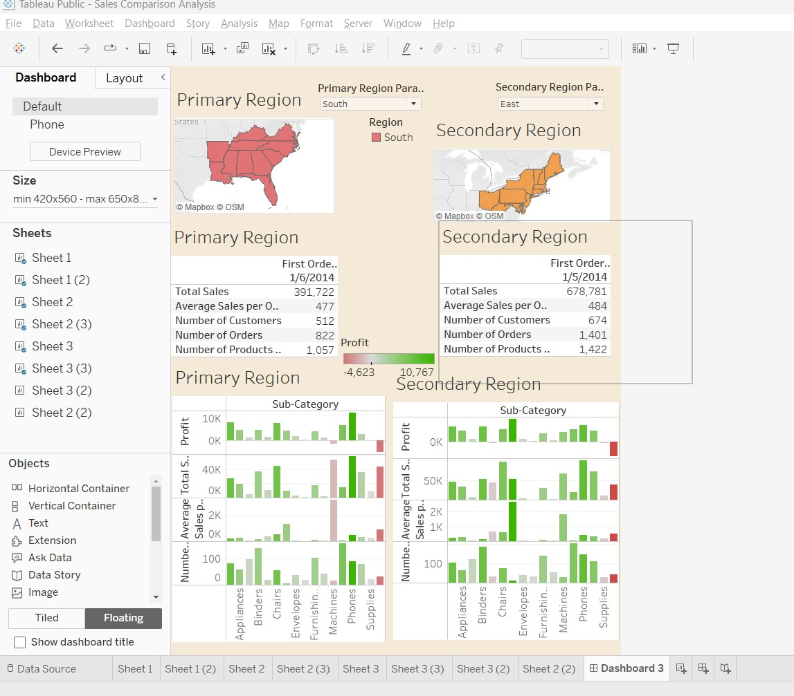

# Region_Based_Sales_Analysis_Tableau

## Link to Dashboard:

https://public.tableau.com/views/SalesComparisonAnalysis_16851514803130/Dashboard3?:language=en-US&:display_count=n&:origin=viz_share_link

## Capstone Project Description:

The director of a leading organization wants to compare the sales between two regions. He has asked each region operators to record the sales data to compare by region. The upper management wants to visualize the sales data using a dashboard to understand the performance between them and suggest the necessary improvements.

 

Objective: Help the organization by creating an interactive dashboard to visualize the sales comparison between two selected regions. 
Datasets: Sample Superstore

Skills Used:

Creating Hierarchies, Parameters, Calculated Fields, Interactive Dashboard 

Requirements: 
Partition the dashboard to display the below details of Primary Region and Secondary Region

First Order Date
Total Sales
Average Sales per Order
No. of Customers
No. of Orders
No. of Products in Sale

### Screenshot of Dashboard

